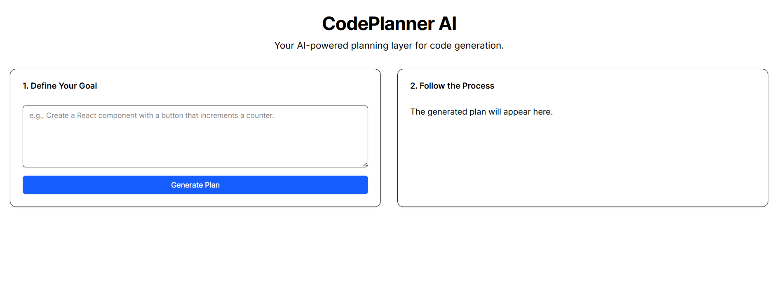

# PlanGen Web 🚀

An interactive web application that acts as an AI-powered planning layer for code generation, inspired by the vision of Traycer. This tool demonstrates a "Plan -> Approve -> Execute" workflow, putting the developer in control of AI-driven development.




---

## Core Concept

PlanGen isn't just another code generator. It's a strategic partner that helps deconstruct complex tasks into manageable steps, ensuring the developer understands and approves the path forward before any code is written. The workflow is simple and powerful:

1.  **Plan:** The user provides a high-level goal (e.g., "Create a React component with a counter"). The AI, acting as a software architect, breaks this down into a concrete, step-by-step plan.
2.  **Approve:** The generated plan is presented to the user in a clean UI. The developer can review the proposed changes and must explicitly approve them before the AI proceeds.
3.  **Execute:** Once approved, the AI, now acting as a developer, executes each step sequentially, generating the final code while providing a real-time log of its progress.

## ✨ Features

-   **AI-Powered Plan Generation:** Leverages the Google Gemini API to create logical development plans.
-   **Interactive Plan Review:** A clean, user-friendly interface for approving or rejecting the AI's proposed plan.
-   **Step-by-Step Execution:** Watch the AI work through the plan with a real-time execution log.
-   **Accordion UI:** A dynamic interface that collapses completed stages to keep the user focused on the current task.
-   **Copy to Clipboard:** Easily copy the final generated code.
-   **Dark Mode:** A sleek, persistent dark theme for a comfortable user experience.
-   **Modern UI:** Built with responsive components, loading states, and toast notifications for a smooth workflow.

## 🛠️ Tech Stack

-   **Framework:** Next.js (App Router)
-   **Language:** TypeScript
-   **Styling:** Tailwind CSS
-   **UI Components:** shadcn/ui
-   **AI Model:** Google Gemini API
-   **Theme Management:** next-themes
-   **Icons:** lucide-react

## 🚀 Getting Started

Follow these instructions to get a local copy up and running for development and testing purposes.

### Prerequisites

-   Node.js (v18 or later)
-   npm or yarn
-   Git

### Installation & Setup

1.  **Clone the repository:**
    Replace `your-username` with your actual GitHub username.
    ```sh
    git clone [https://github.com/your-username/plangen-web.git](https://github.com/your-username/plangen-web.git)
    cd plangen-web
    ```

2.  **Install dependencies:**
    ```sh
    npm install
    ```

3.  **Set up environment variables:**
    Create a file named `.env.local` in the root of your project and add your Google Gemini API key.
    ```
    # .env.local

    GEMINI_API_KEY="YOUR_GEMINI_API_KEY_HERE"
    ```

4.  **Run the development server:**
    ```sh
    npm run dev
    ```

5.  **Open the application:**
    Open [http://localhost:3000](http://localhost:3000) in your browser to see the running app.

## 📄 License

This project is licensed under the MIT License. See the `LICENSE` file for details.
